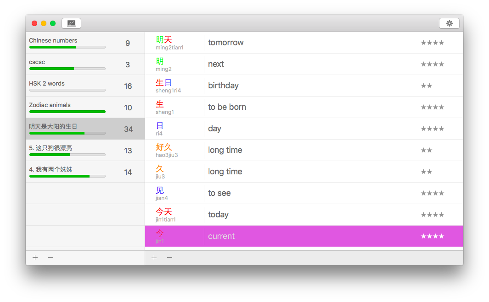
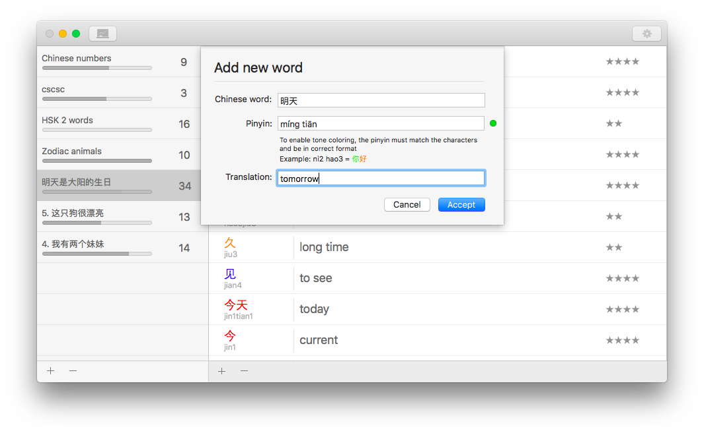
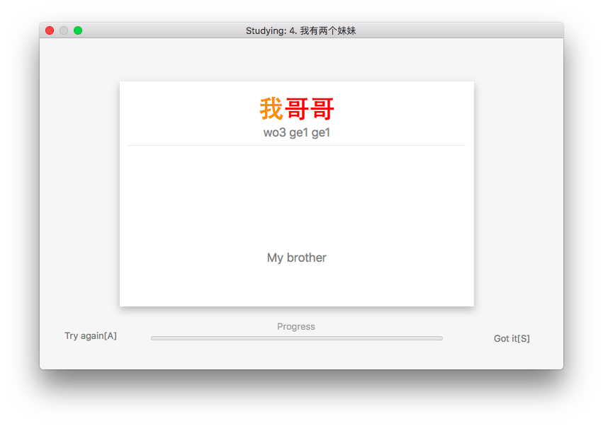

# Chinese-flashcards

This a small app I created to learn Chinese words by using spaced repetion. Adding words is easy, when you type the Chinese word, the system will automatically find the phonetic writing for the word.

The user interface is very intuitive and easy to use.

## The main interface

## Adding a new word

## Studying added words

